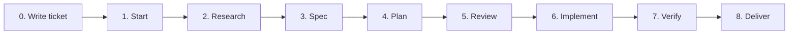

# Ticket Workflow — A Beginner's Guide

> This guide explains our `/ticket-workflow` from start to finish in plain language.
> If you are new to the team (tester or developer), read **only this file** — every term
> is explained, and you will understand the whole process without opening anything else.

---

## First, a simple picture

Think of building a feature like an **assembly line**. The work moves through fixed
stations, one at a time. At each station a worker does one job, fills in one form, and
passes the product to the next station. Nobody skips ahead, and you can always look at
the forms to see exactly what happened.

In our workflow:
- Each **station** is a step you trigger with a slash command (like `/research`).
- Each **form** is a Markdown file the step creates (like `research.md`).
- The **product** is the ticket — one unit of work, e.g. "translate the notification
  messages into Arabic, Turkish, English, and Kurdish."

The whole journey looks like this:



*(Step 8 "Deliver" is a **manual** git step, not a workflow command — see Step 8.)*

---

## A few words you need to know

You will see these words a lot. Here is what each one means, in plain terms:

| Word | Plain meaning |
|------|---------------|
| **Ticket** | One task/feature we are building. It has a name and a folder of its own. |
| **Slug** | The ticket's short name, written-like-this-with-dashes. Example: `translate-notification-messages`. It names the folder and the code branch. |
| **State** | Which station the ticket is at right now (e.g. "research done", "approved"). |
| **Artifact** | A file a step produces — a form filling in what was done. |
| **Front-matter** | The block at the very top of a Markdown file, between two `---` lines, holding settings like `state:` and `mode:`. |
| **Gate** | A checkpoint where a **different person** (a reviewer) must approve before you continue. We have two: Review and Verify. |
| **Branch** | A private copy of the code where you make your changes without disturbing everyone else's work. |
| **Commit** | Saving a snapshot of your code changes with a message. |
| **Push / PR** | Sending your branch to GitHub (**push**) and asking for it to be merged (**PR** = Pull Request). |
| **Mode** | How careful we must be. `standard` = normal work. `high_risk` = touches authentication/session, the app's networking or startup wiring, saved (hydrated) BLoC state, calls/notifications, wallet/order money, or any other high-risk path — so it needs a written decision record and a rollback rehearsal. |

---

## The one rule that matters most

There is **one special file** for every ticket called `ticket.md`. It is the "you are
here" marker on the assembly line. Every step reads it to learn the current state, does
its job, then writes the new state back into it.

👉 **Never guess the state by looking at which files exist. Always trust `ticket.md`.**

Everything for one ticket lives in one folder:
`.claude/_specs/<slug>/` (replace `<slug>` with the ticket's short name).

---

## Step 0 — Write the ticket

**Command:** `/write-ticket`
**Who:** the person requesting the work

**What happens:** You describe the feature in a sentence or two, and this step writes a
proper, complete ticket document. Then you upload it to **ClickUp** (our task-tracking
website) so managers can see it.

**File it creates:** `.claude/tickets/<slug>.md`

Think of this as the **order form** for the whole job. Inside it you will find:
- A small table of basics: the title, which part of the app it affects, who it's for,
  and a time estimate.
- **User Story** — a sentence in the shape "As a [type of user], I want [something], so
  that [benefit]." This keeps everyone focused on *why* we're building it.
- **Acceptance Criteria** — a numbered list of facts that must be true when we're done.
  Each is a simple yes/no ("The success message appears in the user's language").
- **Test Cases** — step-by-step scenarios written as "Given… When… Then…" so a tester
  knows exactly what to try and what to expect.

When you upload it, ClickUp gives back a **task id** (a code like `86ey8t2we`) that links
the ticket to the workflow.

---

## Step 1 — Start the ticket

**Command:** `/start-ticket <slug> "<title>" mode=standard clickup_id=<id>`
**Who:** the developer

**What happens:** This sets up the ticket's folder and its first two files. It does **not**
write any code yet — it just opens the job.

**File it creates:** `.claude/_specs/<slug>/ticket.md` — *the most important file*

This is the "you are here" marker described above. The top of it looks like this:

```yaml
---
ticket: translate-notification-messages
title: Translate notification messages
mode: standard        # standard = normal care needed
state: draft          # <-- the current station on the assembly line
status: active        # active = healthy; "blocked" = stuck, needs help
owner: developer
links:
  clickup: https://app.clickup.com/t/86ey8t2we
  github:             # filled in at the very end
---
```

It also keeps a **history log** — a list that grows by one line each time the ticket
moves forward, so you can always see its full journey:

```yaml
- state: draft
  event: ticket-created
  by: ai_agent
  timestamp: 2026-07-12
```

**File it creates:** `.claude/_specs/<slug>/intake.md`

Think of `intake.md` as the **"is this job clear enough to start?" checklist** — like the
form a hospital fills in at reception *before* a patient sees the doctor. Its whole purpose
is to catch a badly-described request **early**, before anyone spends time researching or
coding something nobody actually understands.

It answers one question: *"Do we understand this request well enough to begin?"*
It does **not** plan anything or look at code — that's for later steps.

**What's inside it, section by section:**

| Section | What it means | Example (from our translation ticket) |
|---------|---------------|----------------------------------------|
| **Ticket Reference** | The ticket's short name + the link to its ClickUp task, so you can jump to the original request. | `translate-notification-messages` · ClickUp `86ey8t2we` |
| **Ticket Summary** | One or two sentences describing the request in normal words. | "Make the notification messages appear in the user's language instead of always English." |
| **Ticket Metadata** | The basics grouped together: id, title, owner, date, links. | owner: developer · created: 2026-07-12 |
| **User Story** | The "As a… I want… so that…" sentence, restated so the *reason* is front and centre. | "As a user, I want messages in my language, so that the app feels native." |
| **Acceptance Criteria Presence Check** | A yes/no: does the request come with clear success conditions? (Not the criteria themselves — just "are they there?") | Present? **yes** |
| **Test Cases Presence Check** | A yes/no: are there test scenarios to check against? | Present? **yes** |
| **Missing Information** | Anything still unknown that would block us. If this list has real blockers, the ticket is **not** ready. | "None blocking." |
| **Readiness Status** | The final verdict: **`READY`** or **`NOT READY`**, with a short reason. | `READY` — scope is clear, files are known, low risk. |

**Why this file is powerful:** the very next step (`/research`) **refuses to run** unless
this file says `READY`. That single rule is a gate that protects the whole team from
wasting effort on a vague request. If something important is missing, you write
`NOT READY`, list what's missing, and the ticket waits until someone fills the gap.

**A simple way to remember it:**
- `intake.md` asks **"Is the request clear?"** (the *what* and *why*).
- `research.md` (next step) asks **"What does the code look like?"** (the *where*).
- `spec.md` asks **"What exactly must be true when done?"**
- `plan.md` asks **"How will we do it?"**

So intake is the **gatekeeper at the front door** — quick, no technical work, just a check
that the request is worth starting.

---

## Step 2 — Research

**Command:** `/research <slug>`
**Who:** the developer

**What happens:** Before deciding anything, we **look around the code** to understand what
we're dealing with. This step only *reads* — it changes **no** code. It's like a builder
surveying the land before drawing plans.

**File it creates:** `.claude/_specs/<slug>/research.md`

The **survey report**. It answers, in plain sections:
- **Which folders and files matter** for this change.
- **Which parts of the app might be affected.**
- **How we'll test it later** (it lists the commands; it doesn't run them yet).
- **Risks** — what could go wrong.
- **Open questions** — anything we still need to find out.

*Real example:* research on our translation ticket discovered that the messages live in
just one file, and a deeper part of the code didn't need touching at all — which made the
whole job smaller.

Finally it moves `ticket.md` forward to `ready-for-research`.

---

## Step 3 — Spec (short for "specification")

**Command:** `/spec <slug>`
**Who:** the developer

**What happens:** We write down **what "finished" means** — the exact requirements and the
tests that prove them. Important: this step contains **no code and no file names yet**. It
describes the *what*, not the *how*.

**File it creates:** `.claude/_specs/<slug>/spec.md`

The **definition of done**. Its key part is a table of **Acceptance Criteria**, where each
line gets a permanent label like **AC-1, AC-2, AC-3**. For example:

| ID | Acceptance criterion |
|----|----------------------|
| AC-1 | Each success message appears in the language the user chose. |
| AC-4 | English messages stay exactly the same as before. |

These labels matter a lot: at the Verify step (Step 7) we will tick off **every single
AC** to prove the work is complete. This is called *traceability* — a clear line from
"what we promised" to "what we tested."

Then it moves `ticket.md` to `research-complete`.

---

## Step 4 — Plan

**Command:** `/plan <slug>`
**Who:** the developer

**What happens:** Now we decide **how** to build it. This is the first place real file
names and technical steps appear.

**File it creates:** `.claude/_specs/<slug>/plan.md`

The **building plan**. It contains:
- **Approach** — the strategy in a couple of sentences.
- **Steps** — the actions in order.
- **Files to change** — an exact list of every file we will edit. (In the next step we're
  only *allowed* to touch files on this list — this stops accidental changes.)
- **Validation strategy** — the exact commands that will prove it works.
- **Rollback** — how to undo everything if something goes wrong.

Then it moves `ticket.md` to `spec-complete`. Note: planning does **not** approve anything
and does **not** create a code branch — that comes after the review.

---

## Step 5 — Review  🚦 (checkpoint #1)

**Command:** `/review <slug> APPROVED "<reason>"`
**Who:** a **reviewer — a different person from whoever wrote the plan**

**What happens:** A second pair of eyes checks the spec and plan **before any code is
written.** This catches bad ideas early, when they're cheap to fix. No coding is allowed
until this checkpoint passes.

**File it creates:** `.claude/_specs/<slug>/review.md`

The **decision record**. The reviewer picks one of three outcomes:

| Decision | Meaning | What happens next |
|----------|---------|-------------------|
| **APPROVED** ✅ | The plan is good — build it. | Ticket moves to `approved`. |
| **CHANGES_REQUESTED** ✏️ | Fix the plan first. | Go back and redo `/plan`, then review again. |
| **REJECTED** ❌ | Don't build this at all. | Ticket is `closed` for good. Open a new one if needed. |

> **Why a different person?** So nobody approves their own work. One reviewer is enough in
> both modes; for `high_risk` tickets the reviewer can *never* be the author, and a written
> decision document (an ADR) is required as well.

---

## Step 6 — Implement

**Command:** `/implement <slug>`
**Who:** the developer

**What happens:** **Now we finally write code.** This step creates the ticket's own code
branch and edits **only** the files listed in the plan — nothing else.

**Code branch it creates:** `ticket/<slug>`

A private copy of the code (branched from the shared `dev_new` branch — this repo has
no `main`) where the changes
are made. Important detail: the changes are **saved to disk but NOT committed yet.** (The
single commit happens at the very end, in Step 8.) This keeps the history clean.

**File it creates:** `.claude/_specs/<slug>/implement.md`

The **"what I actually did" record**. It lists:
- **Changes made** — each file and what changed in it.
- **Files waiting to be committed** — the list sitting on the branch.
- **Deviations** — anything that differed from the plan, and why (or "none").
- **Validation run** — the checks that were run and their results, e.g.
  `flutter analyze` → success, `flutter test` → all passed.

Then it moves `ticket.md` to `implemented`.
(If the work can't be finished safely, it instead marks the ticket **blocked** and writes
down why, so someone can pick it up later.)

---

## Step 7 — Verify  🚦 (checkpoint #2) — most important for testers

**Command:** `/verify <slug>`
**Who:** a **reviewer / tester**

**What happens:** We prove the work is correct by checking it against **every acceptance
criterion** from the spec. This step only *checks* — it doesn't change any code.

**File it creates:** `.claude/_specs/<slug>/verify.md`

The **test results record**. Its heart is a table linking **each AC-n to a Pass or Fail**:

| Criterion | Result |
|-----------|--------|
| AC-1 (message in user's language) | ✅ Pass |
| AC-4 (English unchanged) | ✅ Pass |

The outcome decides everything:

| Outcome | What happens |
|---------|--------------|
| **PASSED** (every AC passes) | Ticket becomes `verified`, then `closed`. 🎉 Done. |
| **FAILED** (any AC fails) | Ticket goes back to "in progress" and is **blocked** until fixed. |

> **Tester tip:** the AC list in `spec.md` is your test script. If an AC isn't clearly Pass,
> it's a Fail — write down exactly what you saw so the developer can fix it.

`closed` is final — we never reopen a ticket. If more work is needed, we open a new one.

---

## Step 8 — Deliver to GitHub (manual)

**Command:** none — this is a **manual** step you do by hand
**Who:** the developer

**What happens:** The finished, verified work is delivered to GitHub for merging. This step
sits *outside* the assembly line — it does **not** change the ticket's state, and no slash
command performs it. You run git yourself and open the Pull Request in the browser.

**What you do by hand (no new form/file):**
1. Stage **only** this ticket's files by explicit path (`git add lib/... .claude/_specs/<slug>/`
   — never `git add -A`), then run `git diff --cached --name-status` to confirm the set so
   unrelated files don't sneak in.
2. Create the **one and only commit** on the `ticket/<slug>` branch
   (`git commit -m "feat(<area>): <summary>"`).
3. **Push** the branch (`git push -u origin ticket/<slug>`), then open the compare URL in
   the browser, set base = `dev_new`, and create the **Pull Request** for review/merge.
4. Paste the PR link into `ticket.md` (the `links.github` field) by hand — the only thing
   this step records.

---

## Cheat sheet — every file at a glance

| File | Made in step | What it's for (in one line) |
|------|--------------|------------------------------|
| `.claude/tickets/<slug>.md` | 0 Write | The order form: story, criteria, tests. Also uploaded to ClickUp. |
| `.claude/_specs/<slug>/ticket.md` | 1 Start | **The "you are here" marker** — the true current state + history. |
| `.claude/_specs/<slug>/intake.md` | 1 Start | The "ready to start?" checklist (READY / NOT READY). |
| `.claude/_specs/<slug>/research.md` | 2 Research | The survey: what the code looks like, risks, questions. |
| `.claude/_specs/<slug>/spec.md` | 3 Spec | The definition of done: requirements + labeled criteria (AC-n). |
| `.claude/_specs/<slug>/plan.md` | 4 Plan | The building plan: approach, files to change, how to test/undo. |
| `.claude/_specs/<slug>/review.md` | 5 Review | The go/no-go decision from a second person. |
| `.claude/_specs/<slug>/implement.md` | 6 Implement | The record of what code actually changed. |
| `.claude/_specs/<slug>/verify.md` | 7 Verify | The test results: each criterion marked Pass/Fail. |
| *(branch `ticket/<slug>` + GitHub PR)* | 6 & 8 | The real code change and its delivery. |

---

## The stations in order (with plain meanings)

| State | Plain meaning |
|-------|---------------|
| `draft` | Just created. |
| `ready-for-research` | Cleared to start investigating. |
| `research-complete` | Investigation done. |
| `spec-complete` | Requirements written. |
| `plan-complete` | Plan written. |
| `approved` | Reviewer said "build it." |
| `implementation-in-progress` | Code is being written. |
| `implemented` | Code is done, waiting to be tested. |
| `verified` | Tested and correct. |
| `closed` | Finished (or rejected). The end — no reopening. |

*(`blocked` is not a station — it's a "stuck, needs help" flag that pauses progress.)*

---

## Golden rules to remember

1. **Go one step at a time. Get an OK before moving to the next station.**
2. **The reviewer at Review and Verify must be a different person from the author.** No
   approving your own work.
3. **Test with `flutter analyze` and `flutter test`.** Do **not** hand-edit generated
   files (`*.g.dart`, `*.config.dart`, `locale_keys.g.dart`) — regenerate them with
   `sh gen.sh` (build_runner) or `sh keys.sh` (localization keys). If you add a
   localization key, add it to **all four** bundles in `assets/languages/`
   (`en-US`, `ar-SY`, `ku-IQ`, `tr-TR`) before regenerating.
4. **`ticket.md` is the truth about the state** — never guess from which files exist.
5. **`closed` is final.** Need more? Open a fresh ticket.
